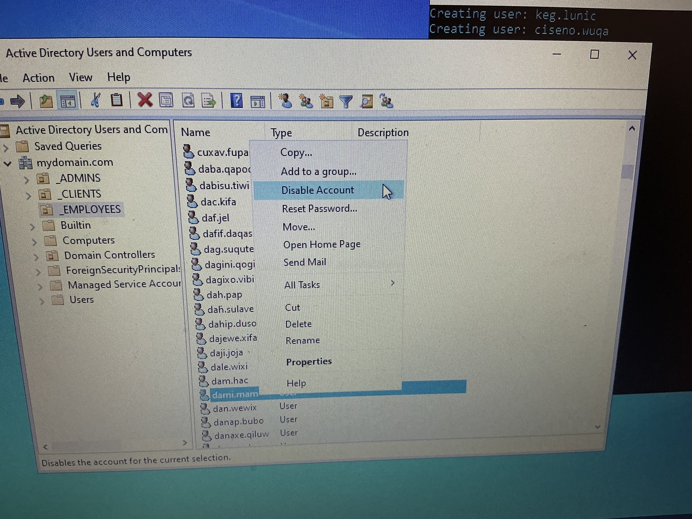
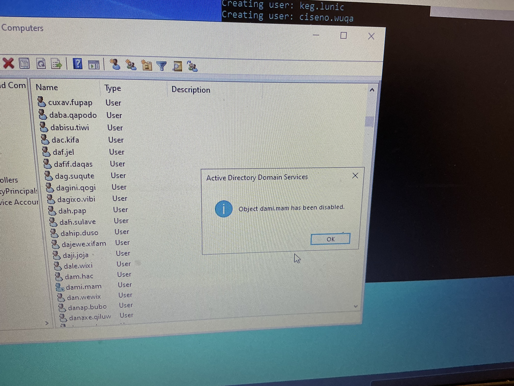
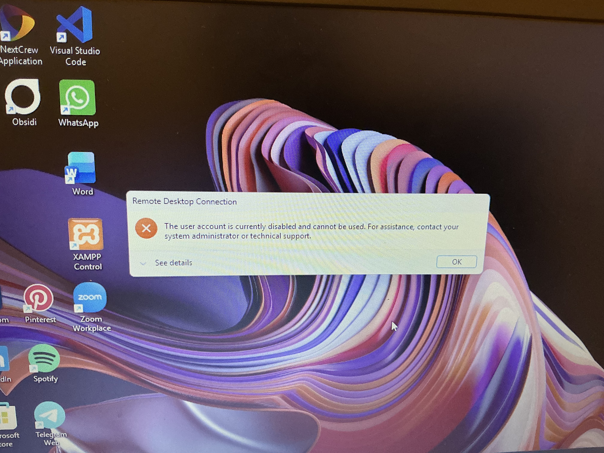
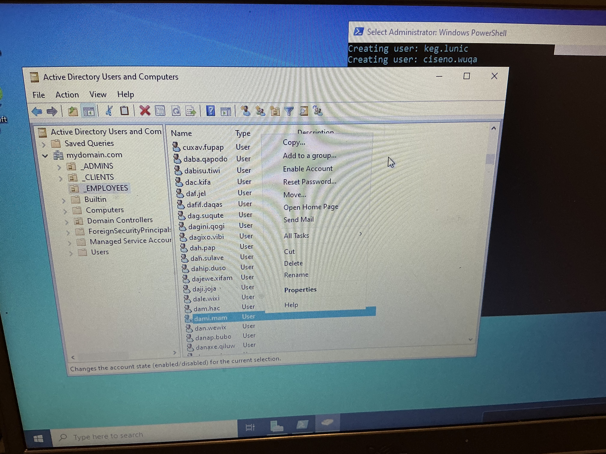
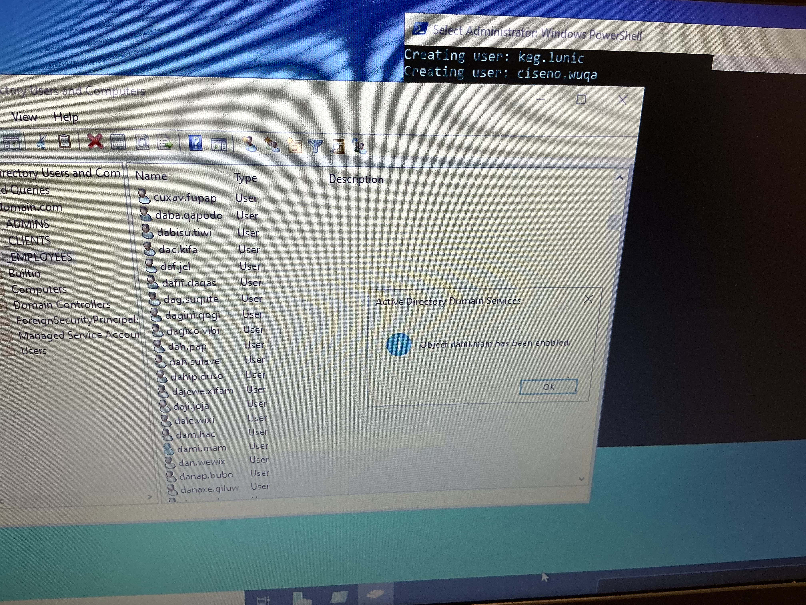

# Enabling and Disabling Accounts
# Overview

This section demonstrates basic Active Directory user account management using Active Directory Users and Computers (ADUC).

The lab covers how a Helpdesk technician can disable a user account when access needs to be removed and re-enable the account when access needs to be restored.

## 1.  Disable a User Account
On DC-1, open:

Server Manager → Tools → Active Directory Users and Computers

Locate the test user account.

Right-click the user and select:Disable Account
The account is now disabled and the user cannot authenticate to the domain.

## 2. Verify the Disabled Account

Attempt to sign in to Client-1 using the disabled user’s account.

The user should be unable to authenticate because the account has been disabled.

## 3. Enable User Account

Return to Active Directory Users and Computers on DC-1.

Locate the disabled user account.

Right-click the account and select:Enable Account

The account is now enabled and can authenticate to the domain again.

## 4.  Verify User Access

Return to Client-1 and sign in using the user’s credentials.

Successful authentication confirms that the account has been re-enabled.

## Skills Demonstrated

- Active Directory Users and Computers (ADUC)
- User account administration
- Enabling and disabling user account
- Basic Helpdesk account management
