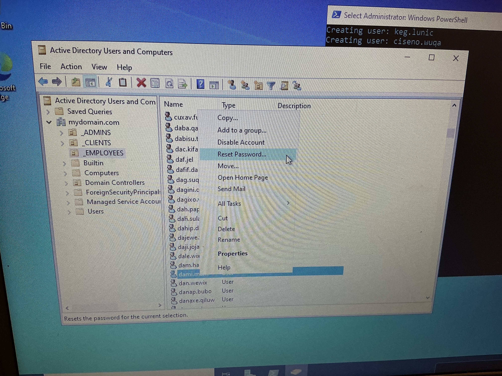
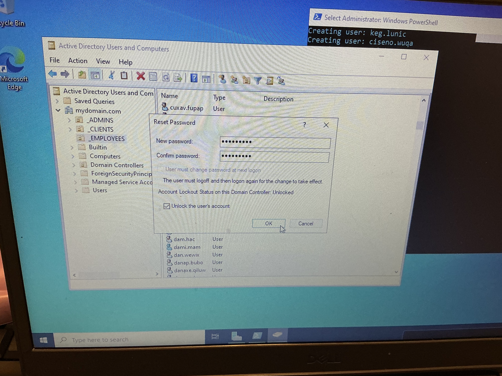

# Ticket 01 — Password Reset Request

**Status:** Resolved  
**Priority:** Medium  
**Category:** Account Management  
**Environment:** Windows Server 2022 domain controller · Windows 10 client · AD DS lab domain

## Problem

User has forgotten their domain password and cannot log into their workstation or any domain resources. Calls the help desk requesting a manual password reset.

## Checks Performed

1. Verified caller identity — confirmed name, department, and manager before proceeding
2. Located the user account in ADUC and confirmed it was active and not locked
3. Reviewed domain password policy (minimum length, complexity, history) via Default Domain Policy in Group Policy Management
4. Confirmed the user had no active logon sessions that would be disrupted by the reset

## Resolution

Right-clicked the user in ADUC → Reset Password. Set a password meeting domain complexity requirements (8+ characters, uppercase, lowercase, number, symbol). Delivered the password to the user verbally — not over email.

