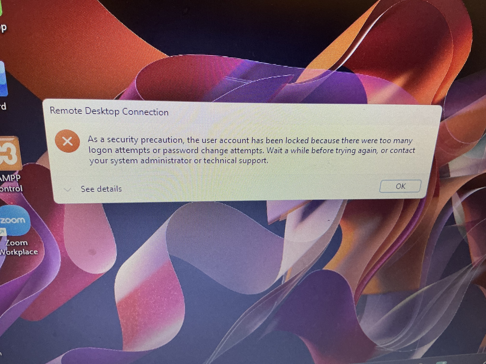
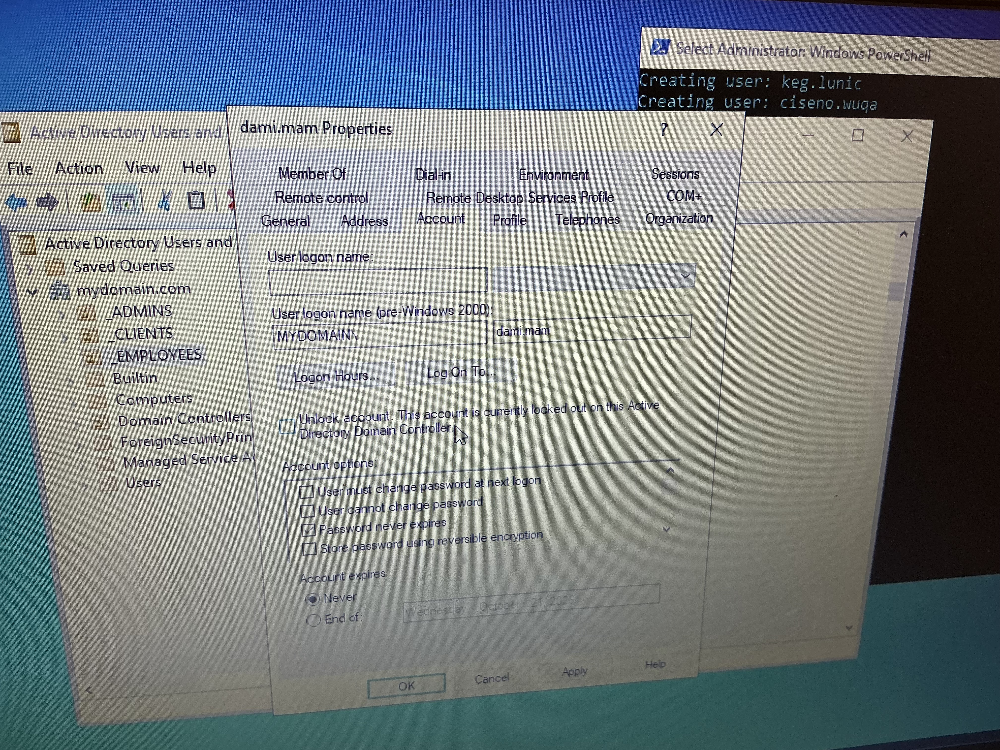
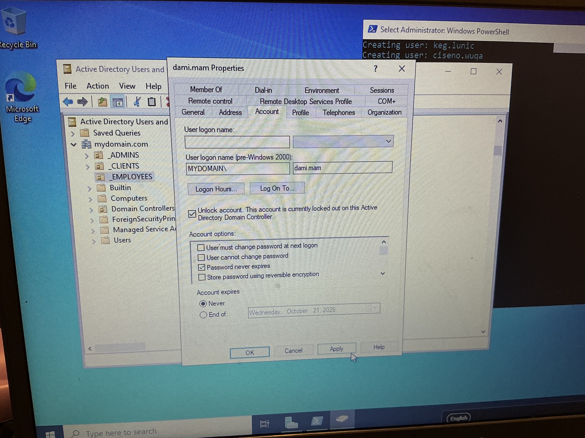

# Ticket 02 — Account Locked Out

**Status:** Resolved  
**Priority:** High  
**Category:** Account Management  
**Environment:** Windows Server 2022 domain controller · Windows 10 client · AD DS lab domain

## Problem 

## Checks Performed

1. Opened ADUC, located the user account — lock icon confirmed the account was locked
2. Checked the Account tab: "Unlock account" checkbox was available, confirming lockout state.

## Resolution

Unlocked the account in ADUC by checking "Unlock account" on the Account tab and clicking Apply.

Confirmation that user is now able to login to account 

